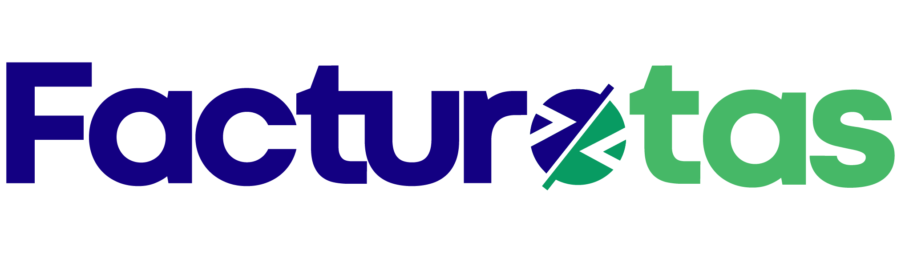

Bienvenido a la documentación de nuestra API de facturación electrónica. Nuestra API SOAP está diseñada para que puedas integrar de forma simple y robusta los flujos de timbrado, consulta y cancelación de Comprobantes Fiscales Digitales por Internet (CFDI) directamente en tus aplicaciones o sistemas ERP.

Automatiza tus procesos fiscales y cumple con todos los requerimientos del SAT de manera segura y eficiente

