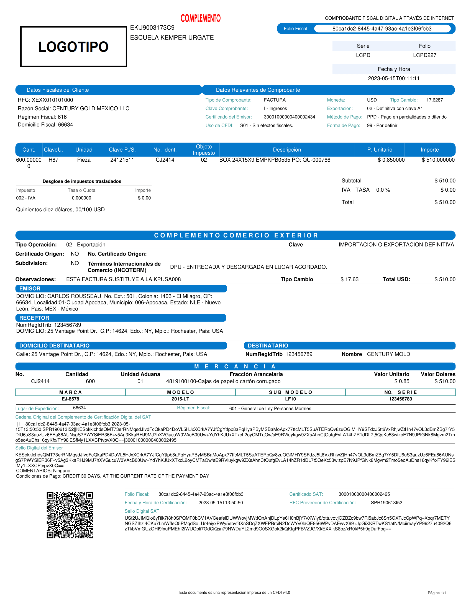

## Plantillas de Ingresos

A continuación se muestran las plantillas disponibles para la generación de facturas de ingresos. Para utilizar una plantilla, simplemente coloque el número correspondiente en el campo "plantilla" al momento de crear el CFDI.

### Plantilla 1
Esta plantilla presenta un diseño clásico y profesional, ideal para la mayoría de las facturas.

**Nota: colocar en el parámetro de plantilla `1`**

### Plantilla 2
Un diseño moderno con el logo a la izquierda y los datos del receptor a la derecha.

**Nota: colocar en el parámetro de plantilla `2`**

### Plantilla 3
Esta plantilla ofrece un formato limpio, con la información organizada de forma clara y concisa.

**Nota: colocar en el parámetro de plantilla `3`**

### Plantilla 4
Diseño optimizado para facturas con múltiples conceptos, facilitando la lectura y revisión.

**Nota: colocar en el parámetro de plantilla `4`**

### Plantilla 5
Plantilla con un enfoque minimalista, perfecta para empresas que prefieren una estética simple y directa.

**Nota: colocar en el parámetro de plantilla `5`**

### Plantilla 6
Este formato destaca el total de la factura, ideal para una rápida visualización de los montos.

**Nota: colocar en el parámetro de plantilla `6`**

### Plantilla 7
Un diseño elegante que incorpora el logo de su empresa de manera prominente.

**Nota: colocar en el parámetro de plantilla `7`**

### Plantilla 8
Plantilla diseñada para facturas de servicios, con espacio adicional para descripciones detalladas.

**Nota: colocar en el parámetro de plantilla `8`**

### Plantilla 9
Formato que prioriza la información del cliente, útil para un seguimiento detallado de cuentas.

**Nota: colocar en el parámetro de plantilla `9`**

## Plantilla de Nómina

### Plantilla de Nómina

Plantilla diseñada para facturación de nómina

**Nota: colocar en el parámetro de plantilla `nomina12`**

## Plantilla de Recepción de Pagos

### Plantilla de recepción de pagos

Plantilla diseñada para las facturas de recepción de pagos

**Nota: colocar en el parámetro de plantilla `pagos20`**

## Plantilla de Carta Porte

### Plantilla de Carta Porte

Plantilla diseñada para las facturas de carta porte

**Nota: colocar en el parámetro de plantilla `transporteterrestre31`**

## Plantilla de comercio exterior

### Plantilla de comercio exterior

Plantilla diseñada para las facturas de comercio exterior y su complemento

**Nota: colocar en el parámetro de plantilla para V1.1 `comercioexterior11`**

**Nota: colocar en el parámetro de plantilla para V2.0 `comercioexterior20`**
